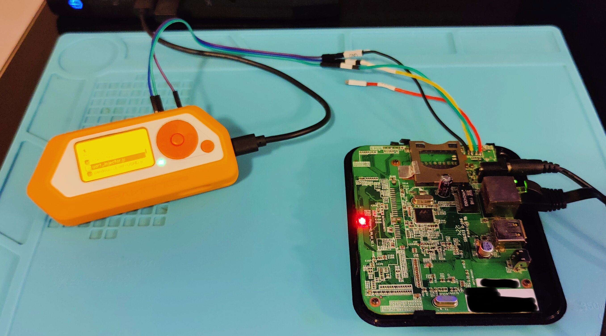

# flipper-js-uart-injector
A Flipper Zero UART command injector written in JavaScript for the Momentum Firmware

# Overview
I wanted to try my hand at using the JavaScript API on the Flipper Zero and decided to try it out with this project.

This script is designed to make it easy to send commands over UART using the Flipper Zero standalone.  These payloads can simply execute a command and exit, or execute a command and capture the output to the SD Card of the Flipper Zero.  Since this is JavaScript, it is easy to modify to add more baud rates or payloads as needed.

`Payloads()` are created in an array and take arguments: the title, the commands to inject, and the post-injection handler function.  At present there are two post payload functions: 

 - `postNOP` does nothing and exits
 - `postReadUntilPrompt` attempts to read input and offers to save it to the SD Card

 When naming the file for the SD card, the `.txt` is not needed and will be automatically added.  Files will be saved to the directory `/apps_data/uart_injector/` on the SD Card

# Current Payloads
The following is a list of the payloads that currently ship with this script.

| Payload | Description |
| ------- | ----------- |
| Bindsh 4444 - Telnetd | Create a persistent (until reboot) passwordless bind shell on TCP port 4444 using `telnetd -p 4444 -l /bin/sh` |
| Get passwd + shadow | Gather `/etc/passwd` and `/etc/shadow` from the device and save it's content to the SD card on the Flipper Zero |
| Get MTD info | Iterates through `/sys/class/mtd/mtd#` and attempts to gather a list of the name, type, and block size of the MTD devices and save it to the SD card on the Flipper Zero |
| Get System info | Gathers general system information from `hostname`, `uname -a`, `/proc/cmdline`, `/proc/board_type`, `ifconfig` & `netstat`, `/proc/cpuinfo` & `/proc/meminfo`, `mount`, executes `/bin/busybox` to gather the applets from help, and `ps`.  This information will be saved to the SD card on the Flipper Zero |
| Reboot / Reboot (Force) | Run the `reboot` or `reboot -f` command |
| Halt / Halt (Force) | Run the `halt` or `halt -f` command |
| Poweroff / Poweroff (Force) | Run the `poweroff` or `poweroff -f` command |
| Kernel Panic Device | Trigger a kernel panic via `echo 'c' > /proc/sysrq-trigger`.  In my testing, the device did not reboot and this put the device in a state where I needed to manually reboot it.  I'm unsure if this device had a watchdog or not. |

# Demo 1 - Bind shell
Just a quick demo of one of the payloads is the bind shell.  First we wire the Flipper Zero up to the UART interface on an embedded device.

Next we try to connect to port 4444 on the device.  It gets rejected.  We run the UART injector and inject the `Bindsh 4444 - Telnetd` payload using the baud rate `115200`.  Now we can connect to TCP port 4444 for a root shell without authentication and the shell will remain open for connections until the device is rebooted. This is useful since you can now disconnect the UART port and just use it over the network.  You could also leave the Flipper Zero connected and trigger the shell anytime you reboot the device using the mobile application remotely so you don't have to keep your lab machine near the device during testing.

# Demo 2 - Gather Information
The following demo shows two of the payloads (`Get MTD info` & `Get System info`) that capture information to the SD Card.

